```python
import pandas as pd
from pandas import Series, DataFrame
```


```python
titanic_df=pd.read_csv(r"C:\Users\RisterBarretoPombo\Documents\Python Training\Titanic Project\train.csv")
```


```python
titanic_df.head()
```


<div>
<style scoped>
    .dataframe tbody tr th:only-of-type {
        vertical-align: middle;
    }

    .dataframe tbody tr th {
        vertical-align: top;
    }

    .dataframe thead th {
        text-align: right;
    }
</style>
<table border="1" class="dataframe">
  <thead>
    <tr style="text-align: right;">
      <th></th>
      <th>PassengerId</th>
      <th>Survived</th>
      <th>Pclass</th>
      <th>Name</th>
      <th>Sex</th>
      <th>Age</th>
      <th>SibSp</th>
      <th>Parch</th>
      <th>Ticket</th>
      <th>Fare</th>
      <th>Cabin</th>
      <th>Embarked</th>
    </tr>
  </thead>
  <tbody>
    <tr>
      <th>0</th>
      <td>1</td>
      <td>0</td>
      <td>3</td>
      <td>Braund, Mr. Owen Harris</td>
      <td>male</td>
      <td>22.0</td>
      <td>1</td>
      <td>0</td>
      <td>A/5 21171</td>
      <td>7.2500</td>
      <td>NaN</td>
      <td>S</td>
    </tr>
    <tr>
      <th>1</th>
      <td>2</td>
      <td>1</td>
      <td>1</td>
      <td>Cumings, Mrs. John Bradley (Florence Briggs Th...</td>
      <td>female</td>
      <td>38.0</td>
      <td>1</td>
      <td>0</td>
      <td>PC 17599</td>
      <td>71.2833</td>
      <td>C85</td>
      <td>C</td>
    </tr>
    <tr>
      <th>2</th>
      <td>3</td>
      <td>1</td>
      <td>3</td>
      <td>Heikkinen, Miss. Laina</td>
      <td>female</td>
      <td>26.0</td>
      <td>0</td>
      <td>0</td>
      <td>STON/O2. 3101282</td>
      <td>7.9250</td>
      <td>NaN</td>
      <td>S</td>
    </tr>
    <tr>
      <th>3</th>
      <td>4</td>
      <td>1</td>
      <td>1</td>
      <td>Futrelle, Mrs. Jacques Heath (Lily May Peel)</td>
      <td>female</td>
      <td>35.0</td>
      <td>1</td>
      <td>0</td>
      <td>113803</td>
      <td>53.1000</td>
      <td>C123</td>
      <td>S</td>
    </tr>
    <tr>
      <th>4</th>
      <td>5</td>
      <td>0</td>
      <td>3</td>
      <td>Allen, Mr. William Henry</td>
      <td>male</td>
      <td>35.0</td>
      <td>0</td>
      <td>0</td>
      <td>373450</td>
      <td>8.0500</td>
      <td>NaN</td>
      <td>S</td>
    </tr>
  </tbody>
</table>
</div>


```python
titanic_df.info()
```

    <class 'pandas.core.frame.DataFrame'>
    RangeIndex: 891 entries, 0 to 890
    Data columns (total 12 columns):
     #   Column       Non-Null Count  Dtype  
    ---  ------       --------------  -----  
     0   PassengerId  891 non-null    int64  
     1   Survived     891 non-null    int64  
     2   Pclass       891 non-null    int64  
     3   Name         891 non-null    object 
     4   Sex          891 non-null    object 
     5   Age          714 non-null    float64
     6   SibSp        891 non-null    int64  
     7   Parch        891 non-null    int64  
     8   Ticket       891 non-null    object 
     9   Fare         891 non-null    float64
     10  Cabin        204 non-null    object 
     11  Embarked     889 non-null    object 
    dtypes: float64(2), int64(5), object(5)
    memory usage: 83.7+ KB
    


```python
#Questions for this project
#1. Who were the passengers on the Titanic (Ages, Gender, Class,... etc)
#2. What deck were the passengers on and how does that relate to their class?
#3. Where did the passengers come from
#4. Who was alone and who with family?
#5. What factors helped someone survive the sinking?
```


```python
import numpy as np
import matplotlib.pyplot as plt
import seaborn as sns
%matplotlib inline
```


```python
c=sns.catplot(y='Sex',data=titanic_df, kind='count')
c.fig.suptitle('Titanic Passengers per Sex')
```


    Text(0.5, 0.98, 'Titanic Passengers per Sex')


    
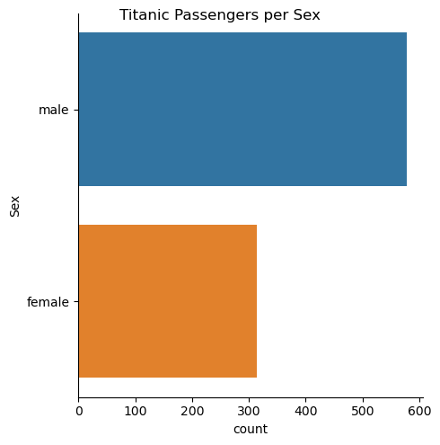
    


```python
titanic_df['Pclass']=titanic_df['Pclass'].astype(str) #making sure the Pclass is a string so that it can be used for a legend

c=sns.catplot(y='Sex',data=titanic_df, kind='count',hue='Pclass')

c.fig.suptitle('Titanic Passengers per Sex and Class')
```


    Text(0.5, 0.98, 'Titanic Passengers per Sex and Class')


    
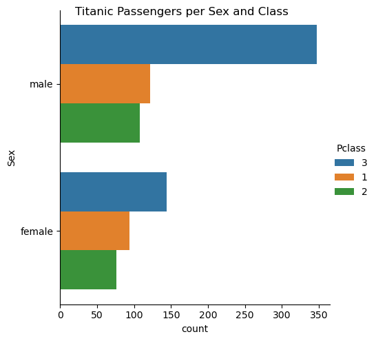
    


```python
c=sns.catplot(y='Pclass',data=titanic_df,kind='count',hue='Sex')

c.fig.suptitle('Titanic Passengers per Class and Sex')
```


    Text(0.5, 0.98, 'Titanic Passengers per Class and Sex')


    
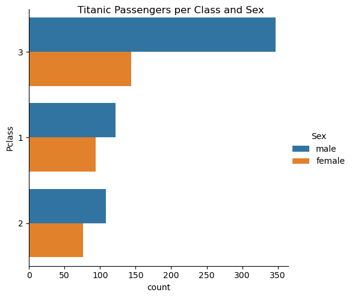
    


```python
def male_female_child(passenger): #create a function to pass passenger as an argument
    age, sex = passenger #passenger is a two-value argument with age and sex
    if age < 16:
        return 'child'
    else:
        return sex
```


```python
titanic_df['person']=titanic_df[['Age','Sex']].apply(male_female_child,axis=1)
```


```python
titanic_df[0:10]
```


<div>
<style scoped>
    .dataframe tbody tr th:only-of-type {
        vertical-align: middle;
    }

    .dataframe tbody tr th {
        vertical-align: top;
    }

    .dataframe thead th {
        text-align: right;
    }
</style>
<table border="1" class="dataframe">
  <thead>
    <tr style="text-align: right;">
      <th></th>
      <th>PassengerId</th>
      <th>Survived</th>
      <th>Pclass</th>
      <th>Name</th>
      <th>Sex</th>
      <th>Age</th>
      <th>SibSp</th>
      <th>Parch</th>
      <th>Ticket</th>
      <th>Fare</th>
      <th>Cabin</th>
      <th>Embarked</th>
      <th>Alone</th>
      <th>Survivor</th>
      <th>person</th>
    </tr>
  </thead>
  <tbody>
    <tr>
      <th>0</th>
      <td>1</td>
      <td>0</td>
      <td>3</td>
      <td>Braund, Mr. Owen Harris</td>
      <td>male</td>
      <td>22.0</td>
      <td>1</td>
      <td>0</td>
      <td>A/5 21171</td>
      <td>7.2500</td>
      <td>NaN</td>
      <td>S</td>
      <td>With Family</td>
      <td>no</td>
      <td>male</td>
    </tr>
    <tr>
      <th>1</th>
      <td>2</td>
      <td>1</td>
      <td>1</td>
      <td>Cumings, Mrs. John Bradley (Florence Briggs Th...</td>
      <td>female</td>
      <td>38.0</td>
      <td>1</td>
      <td>0</td>
      <td>PC 17599</td>
      <td>71.2833</td>
      <td>C85</td>
      <td>C</td>
      <td>With Family</td>
      <td>yes</td>
      <td>female</td>
    </tr>
    <tr>
      <th>2</th>
      <td>3</td>
      <td>1</td>
      <td>3</td>
      <td>Heikkinen, Miss. Laina</td>
      <td>female</td>
      <td>26.0</td>
      <td>0</td>
      <td>0</td>
      <td>STON/O2. 3101282</td>
      <td>7.9250</td>
      <td>NaN</td>
      <td>S</td>
      <td>Alone</td>
      <td>yes</td>
      <td>female</td>
    </tr>
    <tr>
      <th>3</th>
      <td>4</td>
      <td>1</td>
      <td>1</td>
      <td>Futrelle, Mrs. Jacques Heath (Lily May Peel)</td>
      <td>female</td>
      <td>35.0</td>
      <td>1</td>
      <td>0</td>
      <td>113803</td>
      <td>53.1000</td>
      <td>C123</td>
      <td>S</td>
      <td>With Family</td>
      <td>yes</td>
      <td>female</td>
    </tr>
    <tr>
      <th>4</th>
      <td>5</td>
      <td>0</td>
      <td>3</td>
      <td>Allen, Mr. William Henry</td>
      <td>male</td>
      <td>35.0</td>
      <td>0</td>
      <td>0</td>
      <td>373450</td>
      <td>8.0500</td>
      <td>NaN</td>
      <td>S</td>
      <td>Alone</td>
      <td>no</td>
      <td>male</td>
    </tr>
    <tr>
      <th>5</th>
      <td>6</td>
      <td>0</td>
      <td>3</td>
      <td>Moran, Mr. James</td>
      <td>male</td>
      <td>NaN</td>
      <td>0</td>
      <td>0</td>
      <td>330877</td>
      <td>8.4583</td>
      <td>NaN</td>
      <td>Q</td>
      <td>Alone</td>
      <td>no</td>
      <td>male</td>
    </tr>
    <tr>
      <th>6</th>
      <td>7</td>
      <td>0</td>
      <td>1</td>
      <td>McCarthy, Mr. Timothy J</td>
      <td>male</td>
      <td>54.0</td>
      <td>0</td>
      <td>0</td>
      <td>17463</td>
      <td>51.8625</td>
      <td>E46</td>
      <td>S</td>
      <td>Alone</td>
      <td>no</td>
      <td>male</td>
    </tr>
    <tr>
      <th>7</th>
      <td>8</td>
      <td>0</td>
      <td>3</td>
      <td>Palsson, Master. Gosta Leonard</td>
      <td>male</td>
      <td>2.0</td>
      <td>3</td>
      <td>1</td>
      <td>349909</td>
      <td>21.0750</td>
      <td>NaN</td>
      <td>S</td>
      <td>With Family</td>
      <td>no</td>
      <td>child</td>
    </tr>
    <tr>
      <th>8</th>
      <td>9</td>
      <td>1</td>
      <td>3</td>
      <td>Johnson, Mrs. Oscar W (Elisabeth Vilhelmina Berg)</td>
      <td>female</td>
      <td>27.0</td>
      <td>0</td>
      <td>2</td>
      <td>347742</td>
      <td>11.1333</td>
      <td>NaN</td>
      <td>S</td>
      <td>With Family</td>
      <td>yes</td>
      <td>female</td>
    </tr>
    <tr>
      <th>9</th>
      <td>10</td>
      <td>1</td>
      <td>2</td>
      <td>Nasser, Mrs. Nicholas (Adele Achem)</td>
      <td>female</td>
      <td>14.0</td>
      <td>1</td>
      <td>0</td>
      <td>237736</td>
      <td>30.0708</td>
      <td>NaN</td>
      <td>C</td>
      <td>With Family</td>
      <td>yes</td>
      <td>child</td>
    </tr>
  </tbody>
</table>
</div>


```python
c= sns.catplot(y='Pclass',data=titanic_df,kind='count',hue='person')
c.fig.suptitle('Titanic Passenger per Class and Person')
```


    Text(0.5, 0.98, 'Titanic Passenger per Class and Person')


    
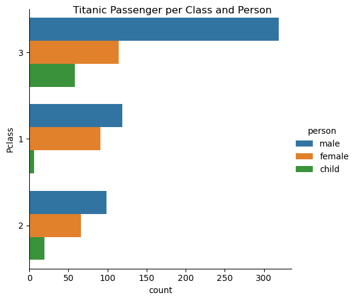
    


```python
titanic_df['Age'].hist(bins=70)
plt.title('Titanic Passenger Age Distribution')
```


    Text(0.5, 1.0, 'Titanic Passenger Age Distribution')


    
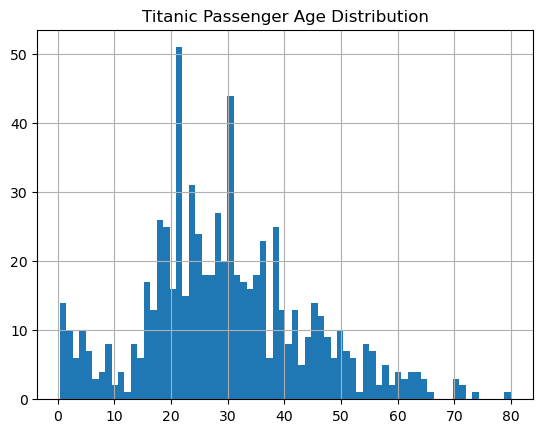
    


```python
Age = titanic_df['Age'].mean()
print ("Avg Age of Titanic Passengers is", round(Age,2))

```

    Avg Age of Titanic Passengers is 29.7
    


```python
titanic_df['person'].value_counts()
```


    person
    male      537
    female    271
    child      83
    Name: count, dtype: int64


```python
titanic_df=titanic_df.replace([np.inf,-np.inf],np.nan)

fig = sns.FacetGrid(titanic_df,hue='Sex',aspect=4)
fig.map(sns.kdeplot,'Age',fill=True)

oldest=titanic_df['Age'].max()

fig.set(xlim=(0,oldest))

fig.add_legend()
```

    C:\Users\RisterBarretoPombo\anaconda3\Lib\site-packages\seaborn\_oldcore.py:1119: FutureWarning: use_inf_as_na option is deprecated and will be removed in a future version. Convert inf values to NaN before operating instead.
      with pd.option_context('mode.use_inf_as_na', True):
    C:\Users\RisterBarretoPombo\anaconda3\Lib\site-packages\seaborn\_oldcore.py:1119: FutureWarning: use_inf_as_na option is deprecated and will be removed in a future version. Convert inf values to NaN before operating instead.
      with pd.option_context('mode.use_inf_as_na', True):
    


    <seaborn.axisgrid.FacetGrid at 0x2bbce607990>


    
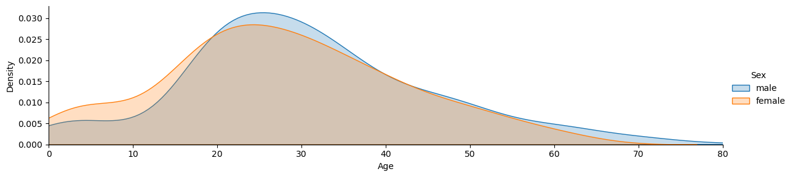
    


```python
titanic_df=titanic_df.replace([np.inf,-np.inf],np.nan)

fig = sns.FacetGrid(titanic_df,hue='person',aspect=4)
fig.map(sns.kdeplot,'Age',fill=True)

oldest=titanic_df['Age'].max()

fig.set(xlim=(0,oldest))

fig.add_legend()
```

    C:\Users\RisterBarretoPombo\anaconda3\Lib\site-packages\seaborn\_oldcore.py:1119: FutureWarning: use_inf_as_na option is deprecated and will be removed in a future version. Convert inf values to NaN before operating instead.
      with pd.option_context('mode.use_inf_as_na', True):
    C:\Users\RisterBarretoPombo\anaconda3\Lib\site-packages\seaborn\_oldcore.py:1119: FutureWarning: use_inf_as_na option is deprecated and will be removed in a future version. Convert inf values to NaN before operating instead.
      with pd.option_context('mode.use_inf_as_na', True):
    C:\Users\RisterBarretoPombo\anaconda3\Lib\site-packages\seaborn\_oldcore.py:1119: FutureWarning: use_inf_as_na option is deprecated and will be removed in a future version. Convert inf values to NaN before operating instead.
      with pd.option_context('mode.use_inf_as_na', True):
    


    <seaborn.axisgrid.FacetGrid at 0x2bbce6c4910>


    
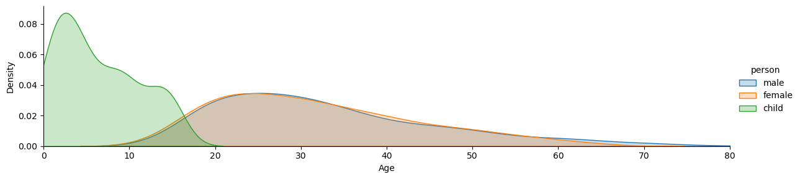
    


```python
titanic_df=titanic_df.replace([np.inf,-np.inf],np.nan)

fig = sns.FacetGrid(titanic_df,hue='Pclass',aspect=4)
fig.map(sns.kdeplot,'Age',fill=True)

oldest=titanic_df['Age'].max()

fig.set(xlim=(0,oldest))

fig.add_legend()
```

    C:\Users\RisterBarretoPombo\anaconda3\Lib\site-packages\seaborn\_oldcore.py:1119: FutureWarning: use_inf_as_na option is deprecated and will be removed in a future version. Convert inf values to NaN before operating instead.
      with pd.option_context('mode.use_inf_as_na', True):
    C:\Users\RisterBarretoPombo\anaconda3\Lib\site-packages\seaborn\_oldcore.py:1119: FutureWarning: use_inf_as_na option is deprecated and will be removed in a future version. Convert inf values to NaN before operating instead.
      with pd.option_context('mode.use_inf_as_na', True):
    C:\Users\RisterBarretoPombo\anaconda3\Lib\site-packages\seaborn\_oldcore.py:1119: FutureWarning: use_inf_as_na option is deprecated and will be removed in a future version. Convert inf values to NaN before operating instead.
      with pd.option_context('mode.use_inf_as_na', True):
    


    <seaborn.axisgrid.FacetGrid at 0x2bbd177efd0>


    
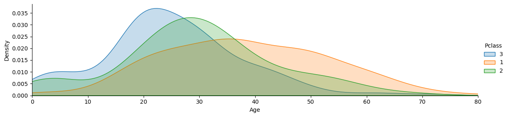
    


```python
titanic_df.head(15)
```


<div>
<style scoped>
    .dataframe tbody tr th:only-of-type {
        vertical-align: middle;
    }

    .dataframe tbody tr th {
        vertical-align: top;
    }

    .dataframe thead th {
        text-align: right;
    }
</style>
<table border="1" class="dataframe">
  <thead>
    <tr style="text-align: right;">
      <th></th>
      <th>PassengerId</th>
      <th>Survived</th>
      <th>Pclass</th>
      <th>Name</th>
      <th>Sex</th>
      <th>Age</th>
      <th>SibSp</th>
      <th>Parch</th>
      <th>Ticket</th>
      <th>Fare</th>
      <th>Cabin</th>
      <th>Embarked</th>
      <th>person</th>
    </tr>
  </thead>
  <tbody>
    <tr>
      <th>0</th>
      <td>1</td>
      <td>0</td>
      <td>3</td>
      <td>Braund, Mr. Owen Harris</td>
      <td>male</td>
      <td>22.0</td>
      <td>1</td>
      <td>0</td>
      <td>A/5 21171</td>
      <td>7.2500</td>
      <td>NaN</td>
      <td>S</td>
      <td>male</td>
    </tr>
    <tr>
      <th>1</th>
      <td>2</td>
      <td>1</td>
      <td>1</td>
      <td>Cumings, Mrs. John Bradley (Florence Briggs Th...</td>
      <td>female</td>
      <td>38.0</td>
      <td>1</td>
      <td>0</td>
      <td>PC 17599</td>
      <td>71.2833</td>
      <td>C85</td>
      <td>C</td>
      <td>female</td>
    </tr>
    <tr>
      <th>2</th>
      <td>3</td>
      <td>1</td>
      <td>3</td>
      <td>Heikkinen, Miss. Laina</td>
      <td>female</td>
      <td>26.0</td>
      <td>0</td>
      <td>0</td>
      <td>STON/O2. 3101282</td>
      <td>7.9250</td>
      <td>NaN</td>
      <td>S</td>
      <td>female</td>
    </tr>
    <tr>
      <th>3</th>
      <td>4</td>
      <td>1</td>
      <td>1</td>
      <td>Futrelle, Mrs. Jacques Heath (Lily May Peel)</td>
      <td>female</td>
      <td>35.0</td>
      <td>1</td>
      <td>0</td>
      <td>113803</td>
      <td>53.1000</td>
      <td>C123</td>
      <td>S</td>
      <td>female</td>
    </tr>
    <tr>
      <th>4</th>
      <td>5</td>
      <td>0</td>
      <td>3</td>
      <td>Allen, Mr. William Henry</td>
      <td>male</td>
      <td>35.0</td>
      <td>0</td>
      <td>0</td>
      <td>373450</td>
      <td>8.0500</td>
      <td>NaN</td>
      <td>S</td>
      <td>male</td>
    </tr>
    <tr>
      <th>5</th>
      <td>6</td>
      <td>0</td>
      <td>3</td>
      <td>Moran, Mr. James</td>
      <td>male</td>
      <td>NaN</td>
      <td>0</td>
      <td>0</td>
      <td>330877</td>
      <td>8.4583</td>
      <td>NaN</td>
      <td>Q</td>
      <td>male</td>
    </tr>
    <tr>
      <th>6</th>
      <td>7</td>
      <td>0</td>
      <td>1</td>
      <td>McCarthy, Mr. Timothy J</td>
      <td>male</td>
      <td>54.0</td>
      <td>0</td>
      <td>0</td>
      <td>17463</td>
      <td>51.8625</td>
      <td>E46</td>
      <td>S</td>
      <td>male</td>
    </tr>
    <tr>
      <th>7</th>
      <td>8</td>
      <td>0</td>
      <td>3</td>
      <td>Palsson, Master. Gosta Leonard</td>
      <td>male</td>
      <td>2.0</td>
      <td>3</td>
      <td>1</td>
      <td>349909</td>
      <td>21.0750</td>
      <td>NaN</td>
      <td>S</td>
      <td>child</td>
    </tr>
    <tr>
      <th>8</th>
      <td>9</td>
      <td>1</td>
      <td>3</td>
      <td>Johnson, Mrs. Oscar W (Elisabeth Vilhelmina Berg)</td>
      <td>female</td>
      <td>27.0</td>
      <td>0</td>
      <td>2</td>
      <td>347742</td>
      <td>11.1333</td>
      <td>NaN</td>
      <td>S</td>
      <td>female</td>
    </tr>
    <tr>
      <th>9</th>
      <td>10</td>
      <td>1</td>
      <td>2</td>
      <td>Nasser, Mrs. Nicholas (Adele Achem)</td>
      <td>female</td>
      <td>14.0</td>
      <td>1</td>
      <td>0</td>
      <td>237736</td>
      <td>30.0708</td>
      <td>NaN</td>
      <td>C</td>
      <td>child</td>
    </tr>
    <tr>
      <th>10</th>
      <td>11</td>
      <td>1</td>
      <td>3</td>
      <td>Sandstrom, Miss. Marguerite Rut</td>
      <td>female</td>
      <td>4.0</td>
      <td>1</td>
      <td>1</td>
      <td>PP 9549</td>
      <td>16.7000</td>
      <td>G6</td>
      <td>S</td>
      <td>child</td>
    </tr>
    <tr>
      <th>11</th>
      <td>12</td>
      <td>1</td>
      <td>1</td>
      <td>Bonnell, Miss. Elizabeth</td>
      <td>female</td>
      <td>58.0</td>
      <td>0</td>
      <td>0</td>
      <td>113783</td>
      <td>26.5500</td>
      <td>C103</td>
      <td>S</td>
      <td>female</td>
    </tr>
    <tr>
      <th>12</th>
      <td>13</td>
      <td>0</td>
      <td>3</td>
      <td>Saundercock, Mr. William Henry</td>
      <td>male</td>
      <td>20.0</td>
      <td>0</td>
      <td>0</td>
      <td>A/5. 2151</td>
      <td>8.0500</td>
      <td>NaN</td>
      <td>S</td>
      <td>male</td>
    </tr>
    <tr>
      <th>13</th>
      <td>14</td>
      <td>0</td>
      <td>3</td>
      <td>Andersson, Mr. Anders Johan</td>
      <td>male</td>
      <td>39.0</td>
      <td>1</td>
      <td>5</td>
      <td>347082</td>
      <td>31.2750</td>
      <td>NaN</td>
      <td>S</td>
      <td>male</td>
    </tr>
    <tr>
      <th>14</th>
      <td>15</td>
      <td>0</td>
      <td>3</td>
      <td>Vestrom, Miss. Hulda Amanda Adolfina</td>
      <td>female</td>
      <td>14.0</td>
      <td>0</td>
      <td>0</td>
      <td>350406</td>
      <td>7.8542</td>
      <td>NaN</td>
      <td>S</td>
      <td>child</td>
    </tr>
  </tbody>
</table>
</div>


```python
deck=titanic_df['Cabin'].dropna()
```


```python
deck.head()
```


    1      C85
    3     C123
    6      E46
    10      G6
    11    C103
    Name: Cabin, dtype: object


```python
levels = [] #creates a blank list
for level in deck: #loops the level in the deck dataset, which is the cabin name
    levels.append(level[0]) #level[0] extracts the first character of the cabin name

cabin_df=DataFrame(levels) #turns the levels into a dataframe
cabin_df.columns=['Cabin'] #gives the dataframe a column name
c=sns.catplot(x='Cabin',data=cabin_df,kind='count',palette='winter')
c.fig.suptitle("Titanic Passengers per Cabin Level")
```


    Text(0.5, 0.98, 'Titanic Passengers per Cabin Level')


    
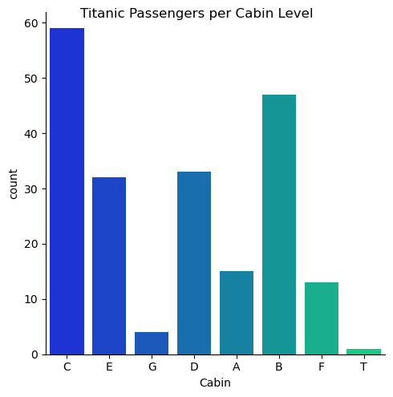
    


```python
cabin_df=cabin_df[cabin_df.Cabin!='T']
c=sns.catplot(x='Cabin',data=cabin_df,kind='count',palette='summer')
c.fig.suptitle('Container Passenger per Cabin')
```


    Text(0.5, 0.98, 'Container Passenger per Cabin')


    
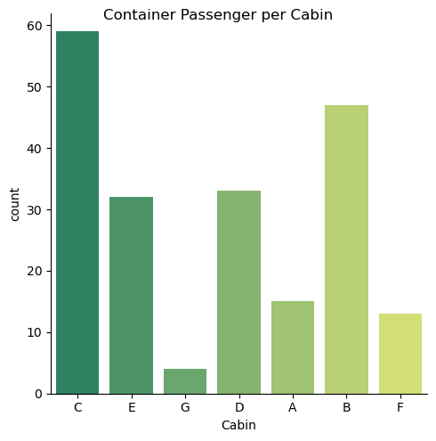
    


```python
titanic_df.head()
```


<div>
<style scoped>
    .dataframe tbody tr th:only-of-type {
        vertical-align: middle;
    }

    .dataframe tbody tr th {
        vertical-align: top;
    }

    .dataframe thead th {
        text-align: right;
    }
</style>
<table border="1" class="dataframe">
  <thead>
    <tr style="text-align: right;">
      <th></th>
      <th>PassengerId</th>
      <th>Survived</th>
      <th>Pclass</th>
      <th>Name</th>
      <th>Sex</th>
      <th>Age</th>
      <th>SibSp</th>
      <th>Parch</th>
      <th>Ticket</th>
      <th>Fare</th>
      <th>Cabin</th>
      <th>Embarked</th>
      <th>person</th>
    </tr>
  </thead>
  <tbody>
    <tr>
      <th>0</th>
      <td>1</td>
      <td>0</td>
      <td>3</td>
      <td>Braund, Mr. Owen Harris</td>
      <td>male</td>
      <td>22.0</td>
      <td>1</td>
      <td>0</td>
      <td>A/5 21171</td>
      <td>7.2500</td>
      <td>NaN</td>
      <td>S</td>
      <td>male</td>
    </tr>
    <tr>
      <th>1</th>
      <td>2</td>
      <td>1</td>
      <td>1</td>
      <td>Cumings, Mrs. John Bradley (Florence Briggs Th...</td>
      <td>female</td>
      <td>38.0</td>
      <td>1</td>
      <td>0</td>
      <td>PC 17599</td>
      <td>71.2833</td>
      <td>C85</td>
      <td>C</td>
      <td>female</td>
    </tr>
    <tr>
      <th>2</th>
      <td>3</td>
      <td>1</td>
      <td>3</td>
      <td>Heikkinen, Miss. Laina</td>
      <td>female</td>
      <td>26.0</td>
      <td>0</td>
      <td>0</td>
      <td>STON/O2. 3101282</td>
      <td>7.9250</td>
      <td>NaN</td>
      <td>S</td>
      <td>female</td>
    </tr>
    <tr>
      <th>3</th>
      <td>4</td>
      <td>1</td>
      <td>1</td>
      <td>Futrelle, Mrs. Jacques Heath (Lily May Peel)</td>
      <td>female</td>
      <td>35.0</td>
      <td>1</td>
      <td>0</td>
      <td>113803</td>
      <td>53.1000</td>
      <td>C123</td>
      <td>S</td>
      <td>female</td>
    </tr>
    <tr>
      <th>4</th>
      <td>5</td>
      <td>0</td>
      <td>3</td>
      <td>Allen, Mr. William Henry</td>
      <td>male</td>
      <td>35.0</td>
      <td>0</td>
      <td>0</td>
      <td>373450</td>
      <td>8.0500</td>
      <td>NaN</td>
      <td>S</td>
      <td>male</td>
    </tr>
  </tbody>
</table>
</div>


```python
c=sns.catplot(x='Embarked',data=titanic_df,kind='count',hue='Pclass',order=['C','Q','S'])
c.fig.suptitle("Titanic Passengers' Origin per Class")
```


    Text(0.5, 0.98, "Titanic Survivors' Origin per Class")


    
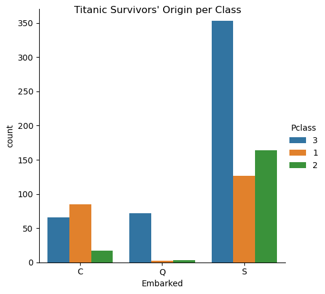
    


```python
def solitary(family):
    SibSp,Parch = family
    if SibSp+Parch ==0:
        return 'alone'
    else:
        return 'with family'

titanic_df['onboarded party']=titanic_df[['SibSp','Parch']].apply(solitary,axis=1)
```


```python
titanic_df.head()
```


<div>
<style scoped>
    .dataframe tbody tr th:only-of-type {
        vertical-align: middle;
    }

    .dataframe tbody tr th {
        vertical-align: top;
    }

    .dataframe thead th {
        text-align: right;
    }
</style>
<table border="1" class="dataframe">
  <thead>
    <tr style="text-align: right;">
      <th></th>
      <th>PassengerId</th>
      <th>Survived</th>
      <th>Pclass</th>
      <th>Name</th>
      <th>Sex</th>
      <th>Age</th>
      <th>SibSp</th>
      <th>Parch</th>
      <th>Ticket</th>
      <th>Fare</th>
      <th>Cabin</th>
      <th>Embarked</th>
      <th>person</th>
      <th>onboarded party</th>
    </tr>
  </thead>
  <tbody>
    <tr>
      <th>0</th>
      <td>1</td>
      <td>0</td>
      <td>3</td>
      <td>Braund, Mr. Owen Harris</td>
      <td>male</td>
      <td>22.0</td>
      <td>1</td>
      <td>0</td>
      <td>A/5 21171</td>
      <td>7.2500</td>
      <td>NaN</td>
      <td>S</td>
      <td>male</td>
      <td>with family</td>
    </tr>
    <tr>
      <th>1</th>
      <td>2</td>
      <td>1</td>
      <td>1</td>
      <td>Cumings, Mrs. John Bradley (Florence Briggs Th...</td>
      <td>female</td>
      <td>38.0</td>
      <td>1</td>
      <td>0</td>
      <td>PC 17599</td>
      <td>71.2833</td>
      <td>C85</td>
      <td>C</td>
      <td>female</td>
      <td>with family</td>
    </tr>
    <tr>
      <th>2</th>
      <td>3</td>
      <td>1</td>
      <td>3</td>
      <td>Heikkinen, Miss. Laina</td>
      <td>female</td>
      <td>26.0</td>
      <td>0</td>
      <td>0</td>
      <td>STON/O2. 3101282</td>
      <td>7.9250</td>
      <td>NaN</td>
      <td>S</td>
      <td>female</td>
      <td>alone</td>
    </tr>
    <tr>
      <th>3</th>
      <td>4</td>
      <td>1</td>
      <td>1</td>
      <td>Futrelle, Mrs. Jacques Heath (Lily May Peel)</td>
      <td>female</td>
      <td>35.0</td>
      <td>1</td>
      <td>0</td>
      <td>113803</td>
      <td>53.1000</td>
      <td>C123</td>
      <td>S</td>
      <td>female</td>
      <td>with family</td>
    </tr>
    <tr>
      <th>4</th>
      <td>5</td>
      <td>0</td>
      <td>3</td>
      <td>Allen, Mr. William Henry</td>
      <td>male</td>
      <td>35.0</td>
      <td>0</td>
      <td>0</td>
      <td>373450</td>
      <td>8.0500</td>
      <td>NaN</td>
      <td>S</td>
      <td>male</td>
      <td>alone</td>
    </tr>
  </tbody>
</table>
</div>


```python
c=sns.catplot(x='Pclass',data=titanic_df,kind='count',hue='onboarded party')
c.fig.suptitle("Titanic Passengers per Class and Onboarded Pary")
```


    Text(0.5, 0.98, 'Titanic Passengers per Class and Onboarded Pary')


    
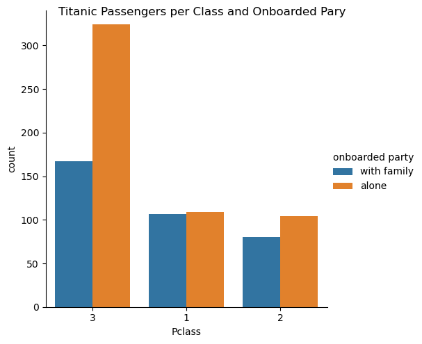
    


```python
titanic_df['Alone']=titanic_df.SibSp+titanic_df.Parch
titanic_df['Alone']
titanic_df['Alone'].loc[titanic_df['Alone']>0]='With Family'
titanic_df['Alone'].loc[titanic_df['Alone']==0]='Alone'
```

    C:\Users\RisterBarretoPombo\AppData\Local\Temp\ipykernel_17844\3698823736.py:3: SettingWithCopyWarning: 
    A value is trying to be set on a copy of a slice from a DataFrame
    
    See the caveats in the documentation: https://pandas.pydata.org/pandas-docs/stable/user_guide/indexing.html#returning-a-view-versus-a-copy
      titanic_df['Alone'].loc[titanic_df['Alone']>0]='With Family'
    C:\Users\RisterBarretoPombo\AppData\Local\Temp\ipykernel_17844\3698823736.py:3: FutureWarning: Setting an item of incompatible dtype is deprecated and will raise in a future error of pandas. Value 'With Family' has dtype incompatible with int64, please explicitly cast to a compatible dtype first.
      titanic_df['Alone'].loc[titanic_df['Alone']>0]='With Family'
    


```python
c=sns.catplot(x='Alone',data=titanic_df,kind='count',palette='Blues')
c.fig.suptitle("Titanic Passengers with Family vs Alone")
```


    Text(0.5, 0.98, 'Titanic Passengers with Family vs Alone')


    
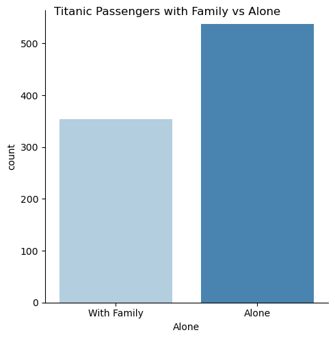
    


```python
titanic_df['Survivor']=titanic_df.Survived.map({0:'no',1:'yes'})

c=sns.catplot(x='Survivor',data=titanic_df,kind='count',palette='Set1')
c.fig.suptitle("Survivors vs Non Survivors in the Titanic Sinking")
```


    Text(0.5, 0.98, 'Survivors vs Non Survivors in the Titanic Sinking')


    
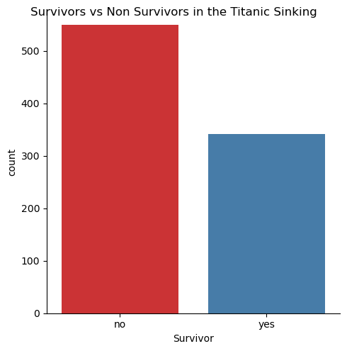
    


```python
titanic_df['Pclass'] = titanic_df['Pclass'].astype(int) #turning Pclass and Survived into numeric values
titanic_df['Survived'] = titanic_df['Survived'].astype(int)

c=sns.catplot(x='Pclass',y='Survived',data=titanic_df,kind='point')
c.fig.suptitle("Number of Survivors per Class")
```


    Text(0.5, 0.98, 'Number of Survivors per Class')


    
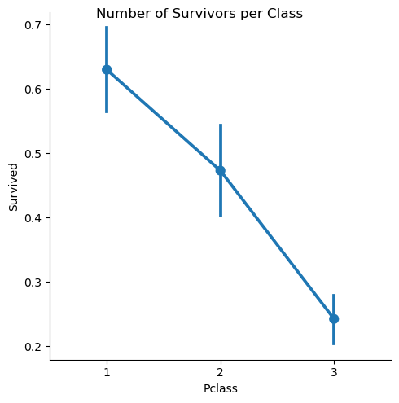
    


```python
c=sns.catplot(x='Pclass',y='Survived',hue='person',data=titanic_df,kind='point')
c.fig.suptitle("Number of Survivors per Class and Person")
```


    Text(0.5, 0.98, 'Number of Survivors per Class and Person')


    
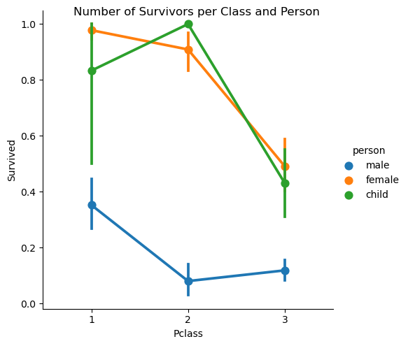
    


```python
c=sns.lmplot(x='Age',y='Survived',data=titanic_df)
c.fig.suptitle("Linear Regression of Survivors per Age Group",y=1.05)
```


    Text(0.5, 1.05, 'Linear Regression of Survivors per Age Group')


    
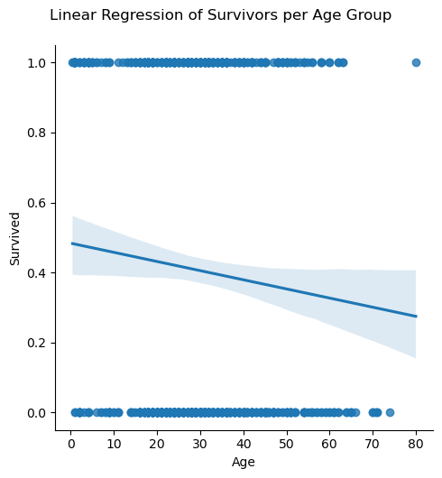
    


```python
c=sns.lmplot(x='Age',y='Survived',hue='Pclass',data=titanic_df,palette='winter')
c.fig.suptitle("Linear Regression of Survivors per Age and Class",y=1.05)
```


    Text(0.5, 1.05, 'Linear Regression of Survivors per Age and Class')


    
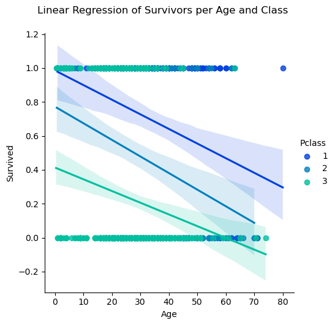
    


```python
generations=[10,20,40,60,80]

c=sns.lmplot(x='Age',y='Survived',hue='Pclass',data=titanic_df,palette='winter',x_bins=generations)

c.fig.suptitle("Survivors per Class and Generarion",y=1.03)
```


    Text(0.5, 1.03, 'Survivors per Class and Generarion')


    
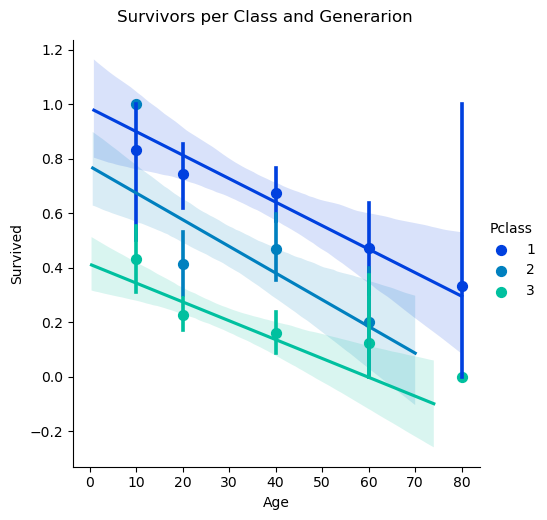
    


```python
c=sns.lmplot(x='Age',y='Survived',hue='Sex',data=titanic_df,palette='muted',x_bins=generations)

c.fig.suptitle("Survivors per Sex and Generarion",y=1.03)
```


    Text(0.5, 1.03, 'Survivors per Sex and Generarion')


    
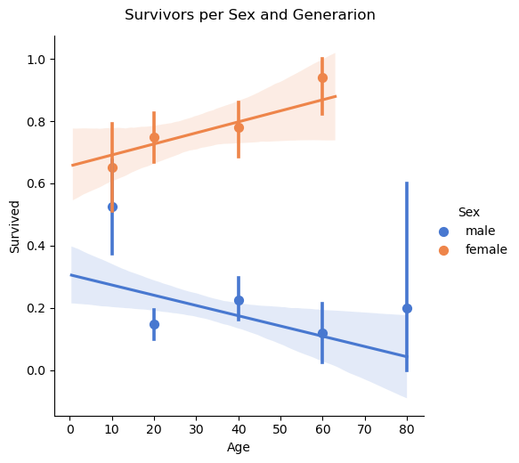
    


```python
titanic_df['cabin level']=titanic_df['Cabin'].str[0]
titanic_df['cabin level']
```


    0      NaN
    1        C
    2      NaN
    3        C
    4      NaN
          ... 
    886    NaN
    887      B
    888    NaN
    889      C
    890    NaN
    Name: cabin level, Length: 891, dtype: object


```python
titanic_df.head()
```


<div>
<style scoped>
    .dataframe tbody tr th:only-of-type {
        vertical-align: middle;
    }

    .dataframe tbody tr th {
        vertical-align: top;
    }

    .dataframe thead th {
        text-align: right;
    }
</style>
<table border="1" class="dataframe">
  <thead>
    <tr style="text-align: right;">
      <th></th>
      <th>PassengerId</th>
      <th>Survived</th>
      <th>Pclass</th>
      <th>Name</th>
      <th>Sex</th>
      <th>Age</th>
      <th>SibSp</th>
      <th>Parch</th>
      <th>Ticket</th>
      <th>Fare</th>
      <th>Cabin</th>
      <th>Embarked</th>
      <th>Alone</th>
      <th>Survivor</th>
      <th>person</th>
      <th>cabin level</th>
    </tr>
  </thead>
  <tbody>
    <tr>
      <th>0</th>
      <td>1</td>
      <td>0</td>
      <td>3</td>
      <td>Braund, Mr. Owen Harris</td>
      <td>male</td>
      <td>22.0</td>
      <td>1</td>
      <td>0</td>
      <td>A/5 21171</td>
      <td>7.2500</td>
      <td>NaN</td>
      <td>S</td>
      <td>With Family</td>
      <td>no</td>
      <td>male</td>
      <td>NaN</td>
    </tr>
    <tr>
      <th>1</th>
      <td>2</td>
      <td>1</td>
      <td>1</td>
      <td>Cumings, Mrs. John Bradley (Florence Briggs Th...</td>
      <td>female</td>
      <td>38.0</td>
      <td>1</td>
      <td>0</td>
      <td>PC 17599</td>
      <td>71.2833</td>
      <td>C85</td>
      <td>C</td>
      <td>With Family</td>
      <td>yes</td>
      <td>female</td>
      <td>C</td>
    </tr>
    <tr>
      <th>2</th>
      <td>3</td>
      <td>1</td>
      <td>3</td>
      <td>Heikkinen, Miss. Laina</td>
      <td>female</td>
      <td>26.0</td>
      <td>0</td>
      <td>0</td>
      <td>STON/O2. 3101282</td>
      <td>7.9250</td>
      <td>NaN</td>
      <td>S</td>
      <td>Alone</td>
      <td>yes</td>
      <td>female</td>
      <td>NaN</td>
    </tr>
    <tr>
      <th>3</th>
      <td>4</td>
      <td>1</td>
      <td>1</td>
      <td>Futrelle, Mrs. Jacques Heath (Lily May Peel)</td>
      <td>female</td>
      <td>35.0</td>
      <td>1</td>
      <td>0</td>
      <td>113803</td>
      <td>53.1000</td>
      <td>C123</td>
      <td>S</td>
      <td>With Family</td>
      <td>yes</td>
      <td>female</td>
      <td>C</td>
    </tr>
    <tr>
      <th>4</th>
      <td>5</td>
      <td>0</td>
      <td>3</td>
      <td>Allen, Mr. William Henry</td>
      <td>male</td>
      <td>35.0</td>
      <td>0</td>
      <td>0</td>
      <td>373450</td>
      <td>8.0500</td>
      <td>NaN</td>
      <td>S</td>
      <td>Alone</td>
      <td>no</td>
      <td>male</td>
      <td>NaN</td>
    </tr>
  </tbody>
</table>
</div>


```python

```
